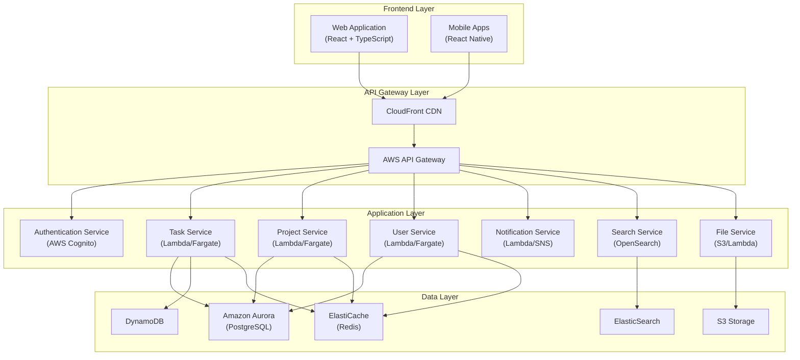
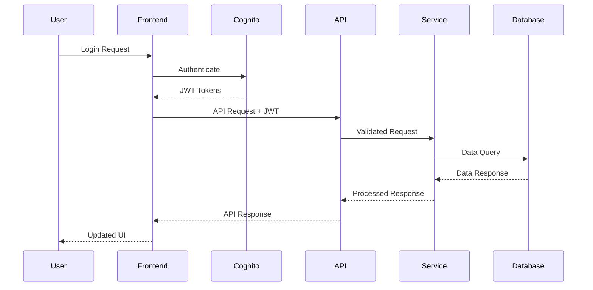
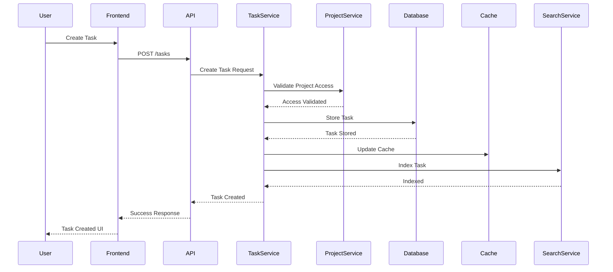

# Technical Requirements Document
## Project Management SaaS Platform
Version 1.0 | December 23, 2024

## 1. System Architecture

### 1.1 High-Level Architecture Overview


### 1.2 Component Details

#### 1.2.1 Frontend Components
- **Web Application**
  - Framework: React 18+ with TypeScript
  - State Management: Redux Toolkit
  - UI Framework: Chakra UI/Material UI
  - Real-time Updates: WebSocket/AWS AppSync
  
- **Mobile Application**
  - Framework: React Native
  - Offline Support: AsyncStorage + SQLite
  - Push Notifications: AWS SNS + FCM/APNS

#### 1.2.2 Backend Services
- **Authentication Service**
  - AWS Cognito for user management
  - JWT token-based authentication
  - OAuth2.0 support for SSO
  - MFA capability
  
- **Task Service**
  - REST API endpoints for CRUD operations
  - Real-time updates via WebSocket
  - Task state machine management
  - Assignment and workflow logic
  
- **Project Service**
  - Project lifecycle management
  - Team and permission management
  - Resource allocation
  - Timeline and milestone tracking
  
- **Notification Service**
  - Email notifications (SES)
  - Push notifications (SNS)
  - In-app notifications (WebSocket)
  - Notification preferences management

#### 1.2.3 Data Stores
- **PostgreSQL (Aurora)**
  - User profiles
  - Project metadata
  - Team structures
  - Permissions and roles
  
- **DynamoDB**
  - Task items
  - Comments
  - Activity logs
  - Real-time status updates
  
- **ElasticSearch**
  - Full-text search
  - Task and project indexing
  - Advanced filtering
  
- **Redis Cache**
  - Session management
  - API response caching
  - Real-time counters
  - Rate limiting

## 2. Data Flow Architecture

### 2.1 Authentication Flow


### 2.2 Task Creation Flow


## 3. Database Schema

### 3.1 PostgreSQL Schema
```sql
-- Users Table
CREATE TABLE users (
    id UUID PRIMARY KEY,
    email VARCHAR(255) UNIQUE NOT NULL,
    full_name VARCHAR(255) NOT NULL,
    status VARCHAR(50),
    created_at TIMESTAMP DEFAULT CURRENT_TIMESTAMP,
    updated_at TIMESTAMP DEFAULT CURRENT_TIMESTAMP
);

-- Projects Table
CREATE TABLE projects (
    id UUID PRIMARY KEY,
    name VARCHAR(255) NOT NULL,
    description TEXT,
    owner_id UUID REFERENCES users(id),
    status VARCHAR(50),
    created_at TIMESTAMP DEFAULT CURRENT_TIMESTAMP,
    updated_at TIMESTAMP DEFAULT CURRENT_TIMESTAMP
);

-- Teams Table
CREATE TABLE teams (
    id UUID PRIMARY KEY,
    name VARCHAR(255) NOT NULL,
    project_id UUID REFERENCES projects(id),
    created_at TIMESTAMP DEFAULT CURRENT_TIMESTAMP
);
```

### 3.2 DynamoDB Schema
```json
{
  "Tasks": {
    "id": "String (UUID)",
    "projectId": "String (UUID)",
    "title": "String",
    "description": "String",
    "status": "String",
    "assigneeId": "String (UUID)",
    "priority": "Number",
    "dueDate": "String (ISO Date)",
    "labels": "String Set",
    "createdAt": "String (ISO DateTime)",
    "updatedAt": "String (ISO DateTime)"
  },
  "Comments": {
    "id": "String (UUID)",
    "taskId": "String (UUID)",
    "userId": "String (UUID)",
    "content": "String",
    "createdAt": "String (ISO DateTime)",
    "updatedAt": "String (ISO DateTime)"
  }
}
```

## 4. API Specifications

### 4.1 REST API Endpoints

#### Tasks API
```yaml
/api/v1/tasks:
  get:
    description: List tasks with filtering
    parameters:
      - name: projectId
        in: query
        type: string
      - name: status
        in: query
        type: string
      - name: assigneeId
        in: query
        type: string
  post:
    description: Create new task
    body: TaskCreateDTO

/api/v1/tasks/{taskId}:
  get:
    description: Get task details
  put:
    description: Update task
    body: TaskUpdateDTO
  delete:
    description: Delete task
```

#### Projects API
```yaml
/api/v1/projects:
  get:
    description: List projects
  post:
    description: Create project
    body: ProjectCreateDTO

/api/v1/projects/{projectId}:
  get:
    description: Get project details
  put:
    description: Update project
    body: ProjectUpdateDTO
  delete:
    description: Delete project
```

## 5. Technical Requirements

### 5.1 Performance Requirements
- API Response Time: < 200ms (95th percentile)
- Page Load Time: < 2s
- Real-time Updates: < 100ms latency
- Search Results: < 500ms
- Concurrent Users: 10,000+ per region
- Data Consistency: Eventually consistent (< 5s)

### 5.2 Scalability Requirements
- Horizontal scaling for all services
- Auto-scaling based on CPU/Memory metrics
- Multi-region deployment capability
- Database read replicas for high-traffic regions

### 5.3 Security Requirements
- HTTPS/TLS 1.3 for all communications
- JWT token-based authentication
- Role-based access control (RBAC)
- Data encryption at rest and in transit
- Regular security audits and penetration testing
- GDPR and CCPA compliance
- Regular backup and disaster recovery procedures

### 5.4 Monitoring Requirements
- Application performance monitoring
- Error tracking and logging
- User activity monitoring
- Resource utilization metrics
- Custom business metrics
- Automated alerts and notifications

## 6. Development Requirements

### 6.1 Development Environment
- Git for version control
- Docker for containerization
- AWS CDK for infrastructure as code
- CI/CD pipeline using GitHub Actions
- Automated testing at all levels
- Code quality and security scanning

### 6.2 Testing Requirements
- Unit Tests: 80%+ coverage
- Integration Tests
- End-to-End Tests
- Performance Tests
- Security Tests
- Accessibility Tests

### 6.3 Documentation Requirements
- API Documentation (OpenAPI/Swagger)
- Code Documentation
- Architecture Documentation
- Deployment Documentation
- User Documentation

## 7. Deployment Strategy

### 7.1 Infrastructure as Code
- AWS CDK for all infrastructure
- Separate stacks for different environments
- Blue-green deployment strategy
- Automated rollback capability

### 7.2 Environment Strategy
- Development
- Staging
- Production
- DR (Disaster Recovery)

### 7.3 Monitoring and Alerts
- CloudWatch Metrics
- CloudWatch Logs
- X-Ray Tracing
- Custom Dashboards
- Alert Thresholds and Escalation Policies
